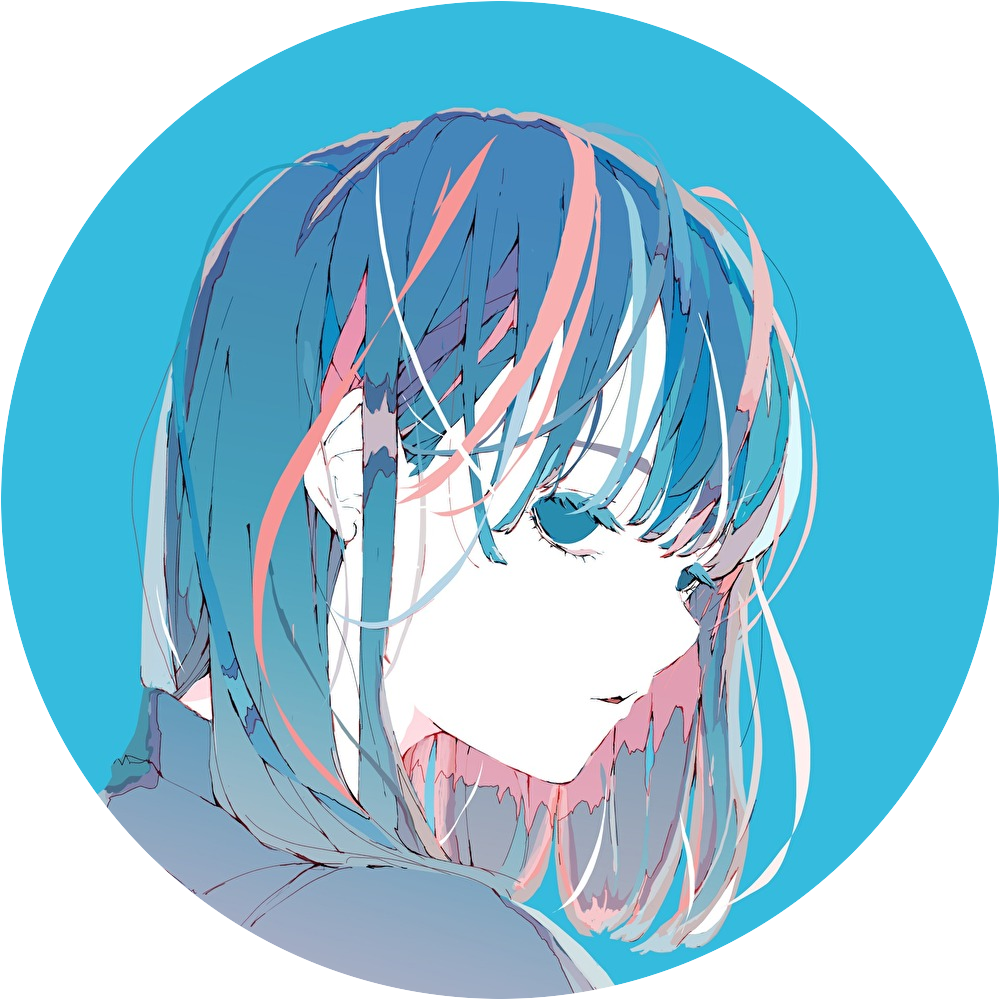

  

  

## 💫 About me
- 👤 Name: Juna1013
- 🧬 Gender: He/Him
- 🌏 Location: Ibaraki, Japan
- 🧑‍💻 Professional: Learning, Algorithm, Mathemathics
- 🎨 Hobbies: Music, Pazle, Art
- ☁️ One liner: "Don't forget death."

## 🛠️ Tech Stack

### 💻 Languages

  
  
  
  

### 📚 Framework & Tools

  
  

## 🗒️ Work Priducts & Achievements
- 2025.05.10：DCON2025に本選出場（95チーム中5位、TOPY工業賞、日立産業制御ソリューションズ賞、Quick賞）
- 2025.08.18：茨城県警サイバーセキュリティボランティア委嘱
- 2025.09.01 - 09.05：EPSON サマーインターンに参加
- 2025.11.26：第5回 得意技・先進技術交流会に参加
- 2025.11.28：第8回CTF神奈川 6位（60人中）

## 🏆 Certifications

- 🥇 **TOEIC L&R**: 690
